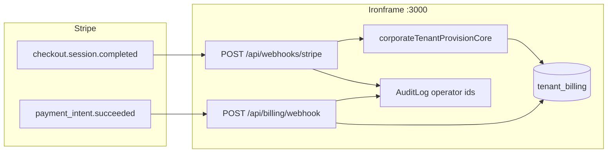
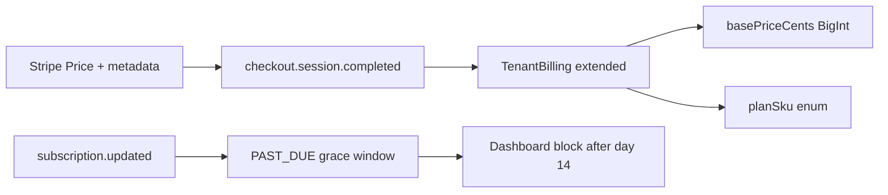

# Epic 17 — Billing & Entitlement Architecture (One-Page Map)

**Release:** `v0.1.0-ga-epic17` · **Branch baseline:** `6361d276` (docs + marketing synced)  
**Audience:** Engineering, platform admin, design-partner onboarding  
**Scope:** Stripe-assisted tenant billing, dashboard gates, tier-scoped feature entitlements, Ironbloom module coupling

---

## 1. Design intent

Epic 17 moves Ironframe from **demo-ready** to **sales-assisted commercial onboarding** without self-serve subdomain sprawl. Money unlocks workspace access; **plan tier** (derived from tenant slug) unlocks module depth. All persisted money uses **BigInt integer cents** — never float.

| Plane | Responsibility |
|-------|----------------|
| **Stripe ingress** | Cryptographically verified webhooks → `tenant_billing` row |
| **Entitlement core** | `TenantBilling.status` + slug → plan tier → feature matrix |
| **UX gate** | Dashboard shell blocks `PENDING` / `PAST_DUE`; GLOBAL_ADMIN bypass |
| **API gate** | Server routes call `assertTenantFeatureEntitled` (e.g. Ironquery export) |

---

## 2. Data model

```prisma
model TenantBilling {
  tenantSlug       String   @unique   // joins Tenant.slug
  stripeCustomerId String   @unique
  status           String   @default("PENDING")  // PENDING | ACTIVE | PAST_DUE
}
```

| Status | Gate behavior | Typical source |
|--------|---------------|----------------|
| **UNTRACKED** | No row → dashboard **open** (legacy / seed tenants) | Pre-Epic-17 tenants |
| **PENDING** | Dashboard **blocked** (except exempt routes) | `ensureTenantBillingPending` on manual provision |
| **ACTIVE** | Dashboard **open**; tier matrix enforced on APIs | Stripe webhooks |
| **PAST_DUE** | Dashboard **blocked** | Future subscription lifecycle (not wired to Stripe subs yet) |

Manual provision placeholder customer id: `manual_pending_{slug}` (`app/lib/billing/constants.ts`).

---

## 3. Dual Stripe ingress (canonical split)



| Webhook | Secret env | Event | Fulfillment |
|---------|------------|-------|-------------|
| `/api/webhooks/stripe` | `STRIPE_INSTANT_CHECKOUT_WEBHOOK_SECRET` (fallback `STRIPE_WEBHOOK_SECRET`) | `checkout.session.completed` | **Provision tenant** + invite user + set `ACTIVE` (`stripeInstantProvisionCore.ts`) |
| `/api/billing/webhook` | `STRIPE_BILLING_WEBHOOK_SECRET` | `payment_intent.succeeded` | **Activate billing only** on existing slug (`stripePaymentIntentCore.ts`) |

**Metadata contract:** `tenant_slug` / `slug`, `stripe_customer_id`, email; checkout adds `companyName`, `amountTotalCents` (BigInt parse).

**Security:** Both routes are **gateway-shield exempt** but require **`stripe-signature` verification** (`verifyStripeWebhookEvent`) — not `validateIngressContext`. Listed in `STRIPE_WEBHOOK_PATHS` for deployment quarantine bypass.

---

## 4. Plan tier → feature matrix

Tier resolves from **tenant slug** (`tenantFeatureEntitlement.ts`) in Phase 1. Phase 2 binds **Stripe Price metadata** → `basePriceCents` + commercial SKU on `TenantBilling`.

### Commercial SKU bind (board-sanctioned)

| Commercial SKU | `basePriceCents` | Engineering tier | Stripe bind (Phase 2) |
|----------------|------------------|--------------------|------------------------|
| Fintech Seed Gate | `3500000` ($35k/yr) | BASELINE | `plan_sku=FINTECH_SEED` |
| Series A Growth Shield | `7500000` ($75k/yr) | SUSTAINABILITY | `plan_sku=SERIES_A_GROWTH` |
| Vault Shield | custom quote | VAULT | `plan_sku=VAULT_SHIELD` |

Full sales narrative: [Pricing & Packaging](../sales/pricing-and-packaging.md).

### Feature entitlements (slug-derived today)

| Slug examples | Plan tier | Entitled features |
|---------------|-----------|-------------------|
| `medshield`, `defense`, `acmecorp` | **BASELINE** | `GRC_DASHBOARD`, `IRONQUERY_EXPORT` (quota 25/mo) |
| `vaultbank` | **VAULT** | + `EVIDENCE_LOCKER_WORM`, `BOARDROOM_AUDIT_LOGS` (quota 200) |
| `gridcore` | **SUSTAINABILITY** | + `SUSTAINABILITY_ANALYTICS`, `CARBON_PULSE` (quota 100) |

**Ironbloom coupling:** Carbon pulse and sustainability analytics require **SUSTAINABILITY** tier **and** `ACTIVE` billing. Physical-unit ingress (kWh, liters, km) remains independent of Stripe; live **Electricity Maps** pulls are optional metered API cost with DB/static fallback.

**API enforcement today:** `POST /api/ironquery/export` → `assertTenantFeatureEntitled(..., "IRONQUERY_EXPORT")`. Expand matrix before GA.

---

## 5. Operator & user surfaces

| Surface | Path | Role |
|---------|------|------|
| Dashboard billing gate | `app/(dashboard)/layout.tsx` → `DashboardBillingGate` | Blocks children when `PENDING`/`PAST_DUE`; **GLOBAL_ADMIN** bypass |
| In-app hold notice | `BillingSuspensionNotice` | Shown inside dashboard shell when blocked |
| Public hold page | `/account/billing-hold` | Standalone degradation + checkout link (`NEXT_PUBLIC_STRIPE_COMMAND_TIER_CHECKOUT_URL`) |
| Admin provision | `/admin/onboarding` | **billing_gate: false** — operators can provision while tenant is `PENDING` |
| Route manifest | `config/route-manifest.v0.1.0-ga-epic17.json` | Documents `billing_gate: true` on integrity, cockpit, evidence, trust, etc. |

---

## 6. Onboarding sequence (design partner)

1. **GLOBAL_ADMIN** mints workspace invitation → corporate provision (`corporateTenantProvisionCore`) → `ensureTenantBillingPending`.
2. Operator sends Stripe Payment Link / Checkout with metadata (`tenant_slug`, customer email).
3. **Path A — New tenant:** `checkout.session.completed` → full provision + `ACTIVE`.
4. **Path B — Existing tenant:** `payment_intent.succeeded` → flip `PENDING` → `ACTIVE` only.
5. User signs in → dashboard gate clears → tier-gated APIs apply.

---

## 7. Cost profile (summary)

| Environment | Billing architecture cost |
|-------------|---------------------------|
| **CI / Vitest** | $0 LLM (mocked `@google/genai`); local Postgres |
| **Manual dev with live keys** | Gemini, Resend, Stripe test mode, Electricity Maps — provider-metered |
| **Production** | Stripe transaction fees; Resend beyond free tier; optional Electricity Maps |

Native BigInt ledgers eliminate **float drift**, not **hosting or processor fees**.

---

## 8. Open items (pre-GA)

- [ ] Wire `customer.subscription.updated/deleted` → `PAST_DUE` / cancel (Phase 2 lifecycle).
- [ ] Commit / wire `tenantFeatureEntitlement.ts` + `/account/billing-hold` if still unstaged on branch.
- [ ] Expand `assertTenantFeatureEntitled` to all `billing_gate: true` routes in manifest.
- [ ] Phase 2: add `basePriceCents`, `planSku`, optional `stripeSubscriptionId` to `TenantBilling`.
- [ ] Phase 2: Stripe Price objects for Fintech Seed / Series A Growth; checkout metadata contract.
- [ ] Document env block in `.env.example`: dual webhook secrets, checkout URL, credential mode (`STRIPE_CREDENTIAL_MODE`).

---

## 10. Phase 2 roadmap — commercial bind (next sprint)

**Goal:** Connect board flat-fee SKUs to Stripe without replacing Phase 1 `TenantBilling`.



| Work item | Detail |
|-----------|--------|
| Schema extension | Add `basePriceCents BigInt?`, `planSku String?`, `stripeSubscriptionId String?` to `tenant_billing` |
| Webhook handler | `customer.subscription.updated` → `PAST_DUE`; `deleted` → `PENDING` or archived |
| Grace horizon | Warn in-app during `PAST_DUE`; hard `DashboardBillingGate` block after configurable offset (default 14 days) |
| Checkout metadata | `plan_sku`, `tenant_slug`, `base_price_cents` validated on ingest |
| Docs | Keep [pricing-and-packaging.md](../sales/pricing-and-packaging.md) as commercial source of truth |

**Explicit non-goals for Phase 2:** Per-user seat metering, new `TenantSubscription` table rename, overage invoicing.

---

## 11. Phase 3 roadmap — dual-engine overage (RFC)

**Principle (board + TAS):** Money and physics never share a persistence row. Phase 3 adds **reconciliation**, not a parallel telemetry schema.

| Engine | Storage (existing — do not duplicate) | Contents |
|--------|--------------------------------------|----------|
| **Billing** | `tenant_billing` + future invoice ledger | `basePriceCents`, status, Stripe ids |
| **Ironbloom** | `SustainabilityMetric`, `CarbonPulseSample`, threat physical telemetry JSON, `gridcore_carbon_coefficients` | kWh, liters, km, gCO₂eq — **no price fields** |

```text
[Stripe subscription events] ──► TenantBilling (cents, status)
[Threat / Kimbot / Carbon pulse] ──► Existing physical tables (units only)
                                              │
                                              ▼
                              Monthly reconciliation job (BigInt)
                                              │
                                              ▼
                                    Overage invoice (Stripe Invoice API)
```

**Ingress rule:** Reject monetary keys (`price`, `cost`, `currency`) at Irongate/Kimbot/Ironbloom ingress boundaries — extend existing validators; **do not** add `IronbloomMetricLog` or `app/api/ironbloom/ingest` unless TAS-amended.

**Overage formula:**

```typescript
// Phase 3 — app/lib/billing/overageReconciliation.ts (planned)
export function computeOverageInvoiceCents(
  basePriceCents: bigint,
  overageUnits: bigint,
  ratePerUnitCents: bigint,
): bigint {
  return basePriceCents + overageUnits * ratePerUnitCents;
}
```

---

## 12. Competitive & cost context

| Question | Answer |
|----------|--------|
| vs Vanta/Drata/Sprinto | Premium flat annual vs per-seat escalation; deeper ALE + agents + Irongate |
| vs ServiceNow/Optro | Transparent mid-market fee vs opaque enterprise SI |
| Local dev cost | $0 LLM in CI (mocked Gemini); $0 Postgres math |
| Production meters | Stripe transaction fees, Resend, optional Electricity Maps |

See [pricing-and-packaging.md](../sales/pricing-and-packaging.md) § Competitive positioning.

---

## 9. Key file index

| Concern | Path |
|---------|------|
| Stripe config | `config/stripe.ts` |
| Status constants | `app/lib/billing/constants.ts` |
| Entitlement resolver | `app/lib/billing/tenantBillingEntitlement.ts` |
| Feature matrix | `app/lib/auth/tenantFeatureEntitlement.ts` |
| Checkout fulfillment | `app/lib/server/stripeInstantProvisionCore.ts` |
| Payment-intent fulfillment | `app/lib/server/stripePaymentIntentCore.ts` |
| Tests | `tests/unit/stripeConfig.test.ts`, `tests/unit/tenantFeatureEntitlement.test.ts` |

**Related:** [Architecture & API](./architecture-and-api.md) · [Pricing & Packaging](../sales/pricing-and-packaging.md) · [Monetization blueprint](../stakeholder-deck/ironframe-monetization-market-blueprint-2026-q2.md) · Feature glossary `BILLING-002`
